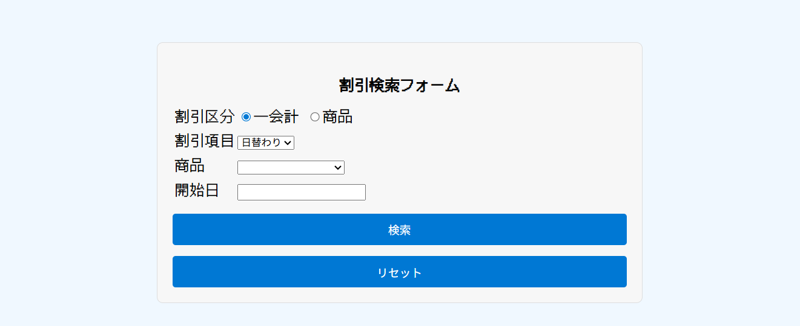

# ec-site-discount
ECサイト 管理画面（割引管理機能）

## 概要
職業訓練校のチーム制作（4人）で開発したECサイトの管理画面のうち、
割引管理機能を担当しました。

## 担当範囲
- 割引の新規登録機能
- 割引検索機能（条件組み合わせ対応）
- 入力チェック・エラーメッセージ表示
- 割引期間の自動設定処理

## 使用技術
- PHP 8
- MySQL
- HTML / CSS
- JavaScript（jQuery DatePicker）

## 工夫した点
- 割引区分・割引項目ごとに SQL を分岐させ、柔軟な検索に対応
- 入力ミス時にエラー内容が分かるよう、項目別にエラーメッセージを表示
- チーム制作のため、他機能と干渉しない実装を意識

## その他担当機能
- 送料管理機能
- 税率管理機能
- 顧客側の商品表示画面
- レビュー登録・表示機能

## 画面イメージ

 

## 補足
※ 学習目的の制作物のため、個人情報や本番データは含まれていません。
